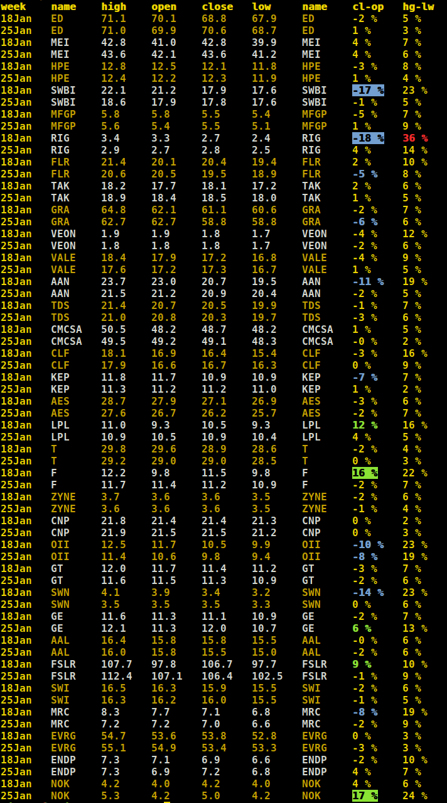

# tinkoff

# install:
python3 -m venv venv
source venv/bin/activate
git clone https://github.com/Awethon/open-api-python-client.git
cd open-api-python-client
python3 setup.py install

# token:
Get Tinkoff API token https://www.tinkoff.ru/invest/settings/
Add token to config.py

# run:
./show_prices.py

# result:
 
